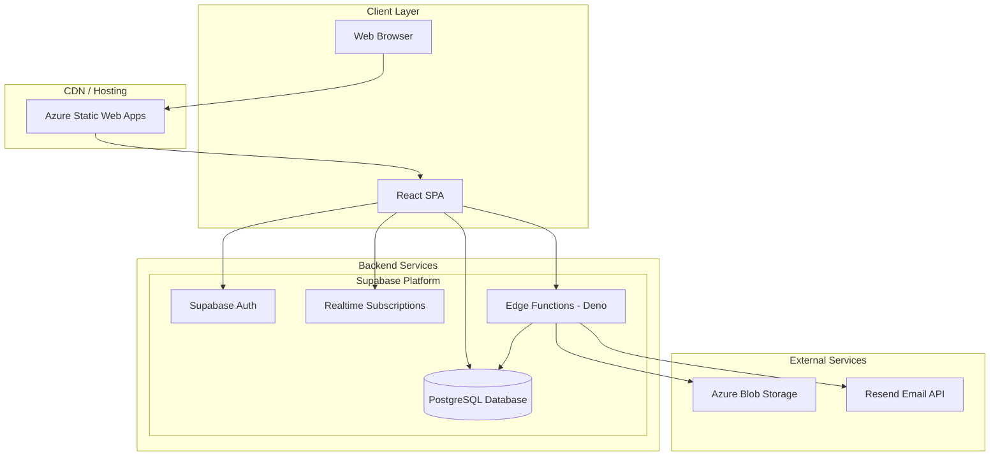
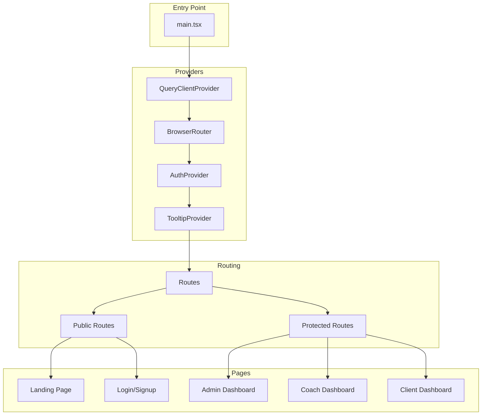
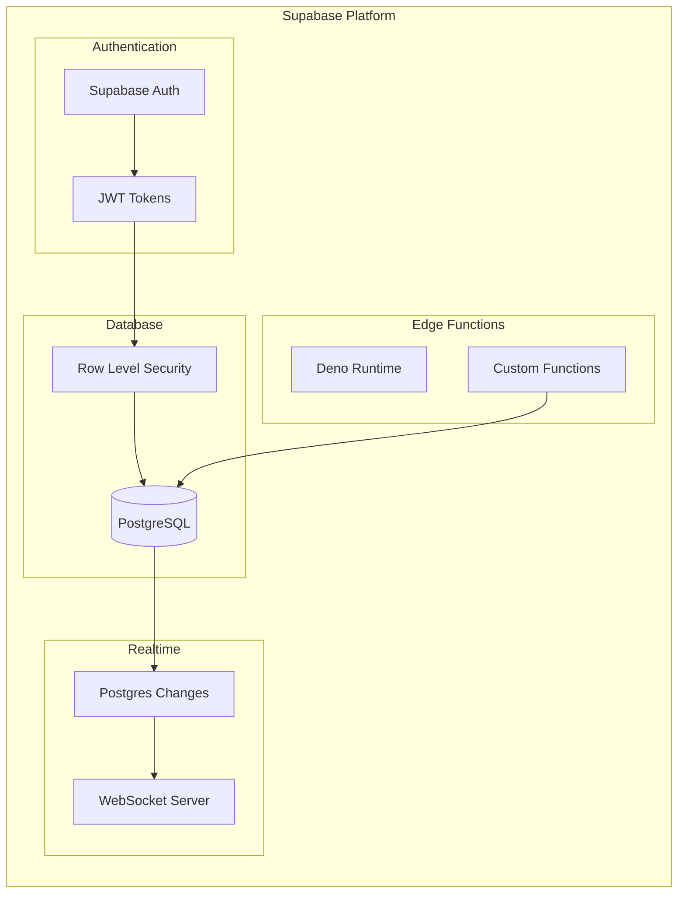
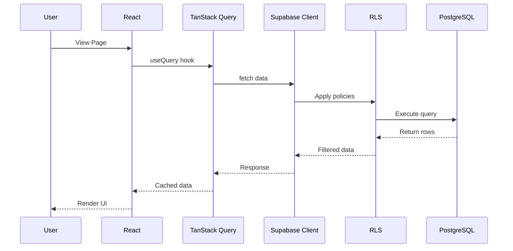
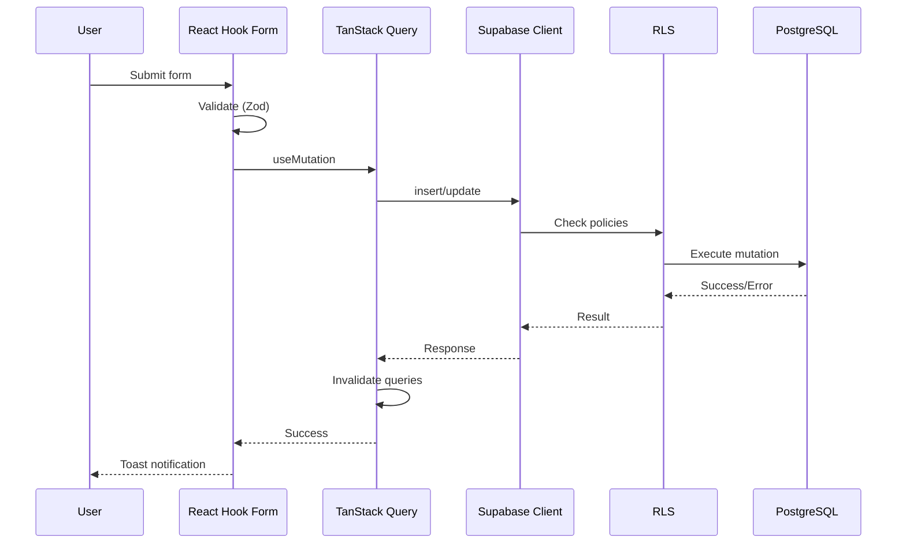
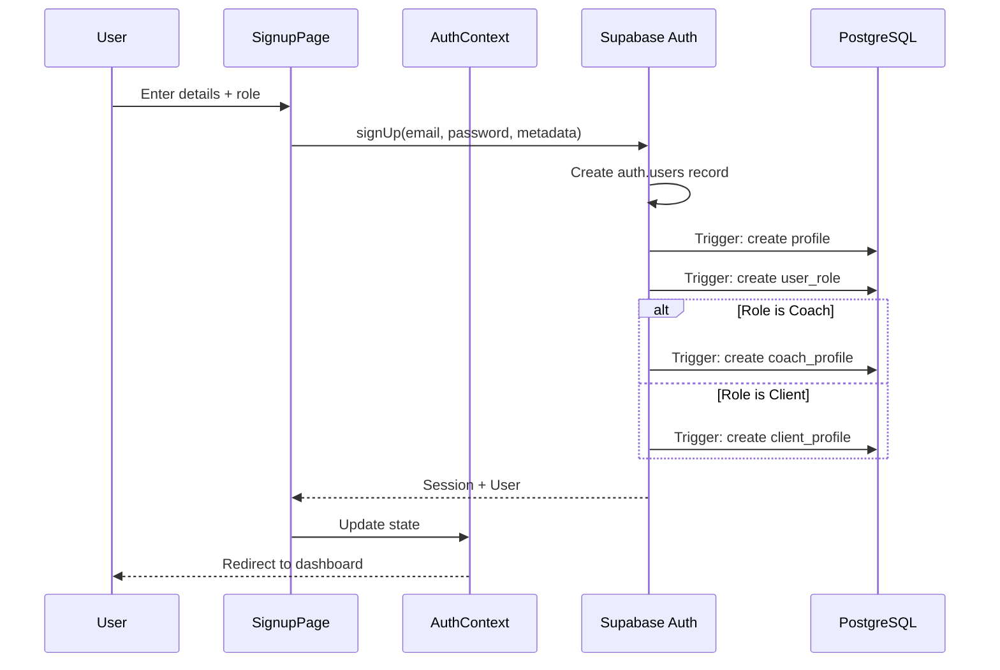
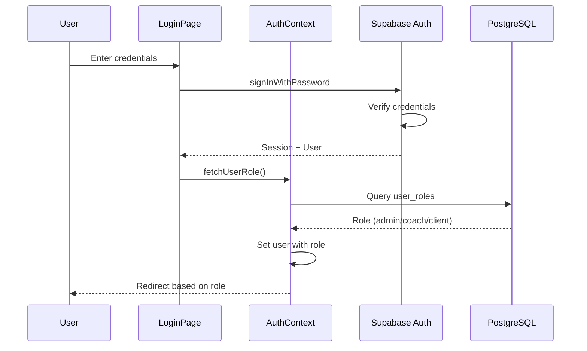
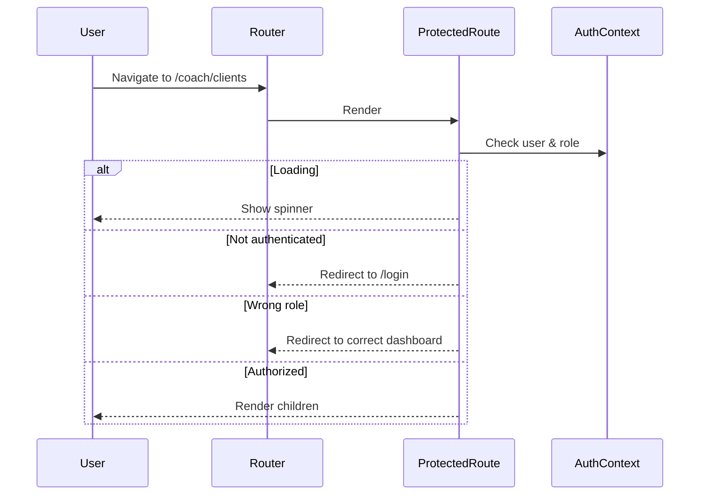
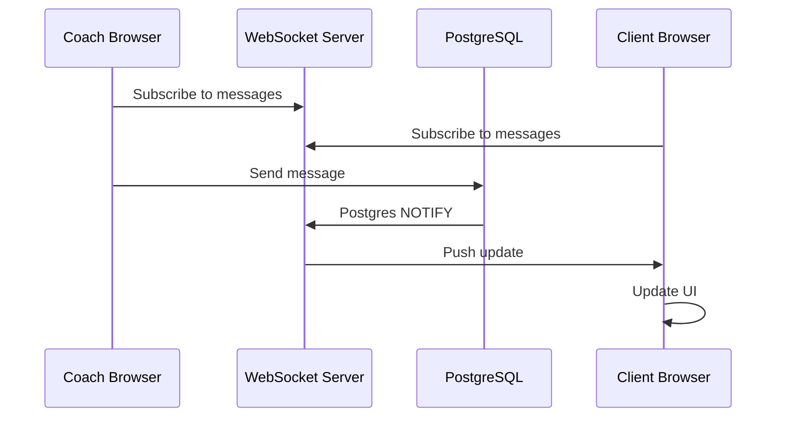
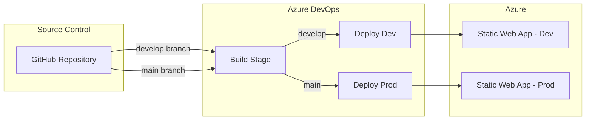

# CustomCoachPro - Architecture Overview

**Author:** Susheel Bhatt  
**Contact:** s.susheel9@gmail.com

---

## Table of Contents

1. [High-Level Architecture](#high-level-architecture)
2. [Technology Stack](#technology-stack)
3. [Frontend Architecture](#frontend-architecture)
4. [Backend Architecture](#backend-architecture)
5. [Data Flow](#data-flow)
6. [Authentication Flow](#authentication-flow)
7. [Real-time Architecture](#real-time-architecture)

---

## High-Level Architecture



---

## Technology Stack

### Frontend Technologies

| Technology | Version | Purpose |
|------------|---------|---------|
| React | 18.3.1 | UI library |
| TypeScript | 5.x | Type-safe JavaScript |
| Vite | 5.x | Build tool and dev server |
| Tailwind CSS | 3.x | Utility-first CSS framework |
| shadcn/ui | Latest | Pre-built UI components |
| TanStack Query | 5.x | Server state management |
| React Router | 6.x | Client-side routing |
| React Hook Form | 7.x | Form management |
| Zod | 3.x | Schema validation |
| Recharts | 2.x | Data visualization |
| Lucide React | Latest | Icon library |
| Framer Motion | (via shadcn) | Animations |

### Backend Technologies

| Technology | Purpose |
|------------|---------|
| Supabase | Backend-as-a-Service platform |
| PostgreSQL | Relational database |
| Supabase Auth | Authentication and authorization |
| Edge Functions | Serverless functions (Deno runtime) |
| Row Level Security | Database access control |

### External Services

| Service | Purpose |
|---------|---------|
| Azure Blob Storage | Progress photo storage |
| Resend | Transactional emails |
| Azure Static Web Apps | Frontend hosting |
| Azure DevOps | CI/CD pipelines |

---

## Frontend Architecture

### Application Structure



### Component Hierarchy

```
App
├── QueryClientProvider (TanStack Query)
│   └── BrowserRouter (React Router)
│       └── AuthProvider (Custom Context)
│           └── TooltipProvider (shadcn/ui)
│               └── Routes
│                   ├── Public Routes
│                   │   ├── Index (Landing Page)
│                   │   ├── Login
│                   │   ├── Signup
│                   │   └── ForgotPassword
│                   └── Protected Routes (ProtectedRoute wrapper)
│                       ├── /admin/* → AdminDashboard
│                       ├── /coach/* → CoachDashboard
│                       └── /client/* → ClientDashboard
```

### State Management Strategy

| State Type | Solution | Use Case |
|------------|----------|----------|
| Server State | TanStack Query | API data, caching, synchronization |
| Auth State | React Context | User session, role information |
| Form State | React Hook Form | Form inputs, validation |
| UI State | React useState | Local component state |
| URL State | React Router | Navigation, route params |

---

## Backend Architecture

### Supabase Services



### Edge Functions Architecture

| Function | Trigger | Purpose |
|----------|---------|---------|
| send-client-invitation | HTTP POST | Send email invitations to clients |
| upload-progress-photo | HTTP POST | Upload photos to Azure Blob Storage |

### Database Architecture

- **34 Tables** across multiple domains
- **Row Level Security** on all tables
- **Custom Functions** for role checking
- **Triggers** for automatic timestamp updates
- **Enums** for type safety

See [Database Schema](./database-schema.md) for complete details.

---

## Data Flow

### Typical Read Operation



### Typical Write Operation



---

## Authentication Flow

### Sign Up Flow



### Sign In Flow



### Protected Route Flow



---

## Real-time Architecture

### Subscription Setup

```typescript
// Example: Real-time message subscription
const channel = supabase
  .channel('messages')
  .on(
    'postgres_changes',
    {
      event: '*',
      schema: 'public',
      table: 'messages',
      filter: `recipient_id=eq.${userId}`
    },
    (payload) => {
      // Handle new/updated message
      queryClient.invalidateQueries(['messages']);
    }
  )
  .subscribe();
```

### Real-time Data Flow



---

## Deployment Architecture

### CI/CD Pipeline



### Environment Strategy

| Environment | Branch | URL | Purpose |
|-------------|--------|-----|---------|
| Development | develop | dev.customcoachpro.com | Testing and QA |
| Production | main | customcoachpro.com | Live users |

---

## Security Architecture

### Defense Layers

1. **Authentication** - Supabase Auth with JWT tokens
2. **Authorization** - Role-based access control
3. **Row Level Security** - Database-level access control
4. **API Security** - HTTPS, CORS policies
5. **Input Validation** - Zod schemas
6. **Environment Secrets** - Secure secret management

See [Security & RLS](./security-rls.md) for detailed policies.

---

## Performance Considerations

### Caching Strategy

| Data Type | Cache Time | Invalidation |
|-----------|------------|--------------|
| User Profile | 5 minutes | On update |
| Exercise List | 10 minutes | Rarely changes |
| Messages | 1 minute | Real-time updates |
| Notifications | 30 seconds | Real-time updates |

### Optimization Techniques

1. **TanStack Query** - Automatic caching and deduplication
2. **Code Splitting** - Route-based lazy loading
3. **Image Optimization** - Thumbnails for progress photos
4. **Database Indexes** - On frequently queried columns
5. **Edge Functions** - Serverless scaling

---

*For questions, contact Susheel Bhatt at s.susheel9@gmail.com*
