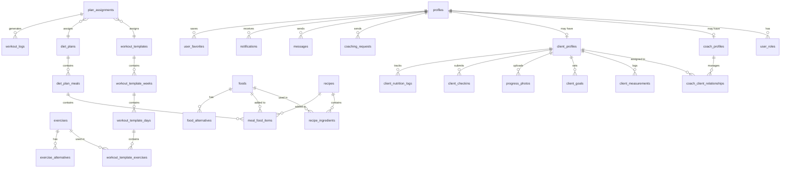

# CustomCoachPro - Database Schema

**Author:** Susheel Bhatt  
**Contact:** s.susheel9@gmail.com

---

## Table of Contents

1. [Schema Overview](#schema-overview)
2. [Entity Relationship Diagram](#entity-relationship-diagram)
3. [Core User Tables](#core-user-tables)
4. [Exercise & Workout Tables](#exercise--workout-tables)
5. [Nutrition Tables](#nutrition-tables)
6. [Client Progress Tables](#client-progress-tables)
7. [Communication Tables](#communication-tables)
8. [Enum Types](#enum-types)
9. [Database Functions](#database-functions)

---

## Schema Overview

CustomCoachPro uses PostgreSQL via Supabase with **34 tables** organized into the following domains:

| Domain | Tables | Purpose |
|--------|--------|---------|
| User Management | 5 | Profiles, roles, relationships |
| Exercise Library | 2 | Exercises and alternatives |
| Workout Programs | 5 | Templates, weeks, days, exercises |
| Nutrition | 9 | Foods, recipes, diet plans, meals |
| Client Progress | 5 | Measurements, photos, goals, check-ins |
| Plan Management | 2 | Assignments and workout logs |
| Communication | 2 | Messages and notifications |
| Favorites | 1 | User favorites |

---

## Entity Relationship Diagram



---

## Core User Tables

### profiles

Central user profile table linked to Supabase Auth.

| Column | Type | Nullable | Default | Description |
|--------|------|----------|---------|-------------|
| id | uuid | NO | gen_random_uuid() | Primary key |
| user_id | uuid | NO | - | References auth.users |
| email | text | NO | - | User email |
| full_name | text | NO | - | Display name |
| avatar_url | text | YES | - | Profile picture URL |
| bio | text | YES | - | User biography |
| phone | text | YES | - | Contact phone |
| gender | text | YES | - | User gender |
| date_of_birth | date | YES | - | Birth date |
| created_at | timestamptz | NO | now() | Record creation |
| updated_at | timestamptz | NO | now() | Last update |

### user_roles

Maps users to application roles.

| Column | Type | Nullable | Default | Description |
|--------|------|----------|---------|-------------|
| id | uuid | NO | gen_random_uuid() | Primary key |
| user_id | uuid | NO | - | References auth.users |
| role | app_role | NO | - | super_admin, coach, or client |
| created_at | timestamptz | NO | now() | Record creation |

### coach_profiles

Extended profile for coach users.

| Column | Type | Nullable | Default | Description |
|--------|------|----------|---------|-------------|
| id | uuid | NO | gen_random_uuid() | Primary key |
| user_id | uuid | NO | - | References auth.users |
| specializations | text[] | YES | - | Areas of expertise |
| certifications | text[] | YES | - | Professional certifications |
| experience_years | integer | YES | - | Years of experience |
| hourly_rate | numeric | YES | - | Coaching rate |
| currency | text | YES | 'USD' | Rate currency |
| max_clients | integer | YES | - | Maximum client capacity |
| is_accepting_clients | boolean | YES | true | Availability flag |
| rating | numeric | YES | - | Average client rating |
| total_reviews | integer | YES | 0 | Number of reviews |
| stripe_account_id | text | YES | - | Payment integration |
| created_at | timestamptz | NO | now() | Record creation |
| updated_at | timestamptz | NO | now() | Last update |

### client_profiles

Extended profile for client users.

| Column | Type | Nullable | Default | Description |
|--------|------|----------|---------|-------------|
| id | uuid | NO | gen_random_uuid() | Primary key |
| user_id | uuid | NO | - | References auth.users |
| coach_id | uuid | YES | - | Assigned coach user_id |
| height_cm | numeric | YES | - | Height in centimeters |
| current_weight_kg | numeric | YES | - | Current weight |
| target_weight_kg | numeric | YES | - | Goal weight |
| fitness_level | text | YES | - | beginner/intermediate/advanced |
| fitness_goals | text[] | YES | - | Selected goals |
| dietary_restrictions | text[] | YES | - | Food restrictions |
| medical_conditions | text | YES | - | Health notes |
| subscription_status | text | YES | - | Subscription state |
| subscription_end_date | timestamptz | YES | - | Subscription expiry |
| created_at | timestamptz | NO | now() | Record creation |
| updated_at | timestamptz | NO | now() | Last update |

### coach_client_relationships

Tracks coach-client pairings.

| Column | Type | Nullable | Default | Description |
|--------|------|----------|---------|-------------|
| id | uuid | NO | gen_random_uuid() | Primary key |
| coach_id | uuid | NO | - | Coach user_id |
| client_id | uuid | NO | - | Client user_id |
| status | text | YES | 'active' | active/paused/ended |
| started_at | timestamptz | YES | now() | Relationship start |
| ended_at | timestamptz | YES | - | Relationship end |
| notes | text | YES | - | Coach notes |
| created_at | timestamptz | NO | now() | Record creation |
| updated_at | timestamptz | NO | now() | Last update |

### coaching_requests

Manages coach-client pairing requests.

| Column | Type | Nullable | Default | Description |
|--------|------|----------|---------|-------------|
| id | uuid | NO | gen_random_uuid() | Primary key |
| client_id | uuid | NO | - | Requesting client |
| coach_id | uuid | NO | - | Target coach |
| status | text | NO | 'pending' | pending/accepted/declined |
| message | text | YES | - | Client message |
| coach_response | text | YES | - | Coach response |
| responded_at | timestamptz | YES | - | Response timestamp |
| created_at | timestamptz | NO | now() | Record creation |
| updated_at | timestamptz | NO | now() | Last update |

---

## Exercise & Workout Tables

### exercises

Exercise library with detailed instructions.

| Column | Type | Nullable | Default | Description |
|--------|------|----------|---------|-------------|
| id | uuid | NO | gen_random_uuid() | Primary key |
| name | text | NO | - | Exercise name |
| description | text | YES | - | Brief description |
| primary_muscle | muscle_group | NO | - | Main muscle targeted |
| secondary_muscles | muscle_group[] | YES | - | Supporting muscles |
| equipment | equipment_type | NO | - | Required equipment |
| difficulty | difficulty_level | NO | 'intermediate' | Skill level |
| exercise_type | exercise_type | NO | 'compound' | Movement type |
| instructions | text[] | YES | - | Step-by-step guide |
| tips | text[] | YES | - | Performance tips |
| common_mistakes | text[] | YES | - | Mistakes to avoid |
| video_url | text | YES | - | Demo video link |
| image_url | text | YES | - | Demo image link |
| is_system | boolean | NO | false | System-provided |
| created_by | uuid | YES | - | Creator user_id |
| created_at | timestamptz | NO | now() | Record creation |
| updated_at | timestamptz | NO | now() | Last update |

### exercise_alternatives

Maps alternative exercises.

| Column | Type | Nullable | Default | Description |
|--------|------|----------|---------|-------------|
| id | uuid | NO | gen_random_uuid() | Primary key |
| exercise_id | uuid | NO | - | Original exercise |
| alternative_exercise_id | uuid | NO | - | Alternative exercise |
| notes | text | YES | - | Substitution notes |
| created_at | timestamptz | NO | now() | Record creation |

### workout_templates

Workout program templates.

| Column | Type | Nullable | Default | Description |
|--------|------|----------|---------|-------------|
| id | uuid | NO | gen_random_uuid() | Primary key |
| name | text | NO | - | Template name |
| description | text | YES | - | Template description |
| difficulty | difficulty_level | NO | 'intermediate' | Program difficulty |
| template_type | template_type | YES | - | Program style |
| goal | text | YES | - | Target outcome |
| days_per_week | integer | NO | 3 | Training frequency |
| duration_weeks | integer | YES | - | Program length |
| is_periodized | boolean | NO | false | Has week variations |
| is_system | boolean | NO | false | System-provided |
| created_by | uuid | YES | - | Creator user_id |
| cloned_from | uuid | YES | - | Source template |
| created_at | timestamptz | NO | now() | Record creation |
| updated_at | timestamptz | NO | now() | Last update |

### workout_template_weeks

Weekly structure for periodized programs.

| Column | Type | Nullable | Default | Description |
|--------|------|----------|---------|-------------|
| id | uuid | NO | gen_random_uuid() | Primary key |
| template_id | uuid | NO | - | Parent template |
| week_number | integer | NO | - | Week sequence |
| name | text | YES | - | Week name |
| focus | text | YES | - | Training focus |
| notes | text | YES | - | Coach notes |
| created_at | timestamptz | NO | now() | Record creation |

### workout_template_days

Daily workout structure.

| Column | Type | Nullable | Default | Description |
|--------|------|----------|---------|-------------|
| id | uuid | NO | gen_random_uuid() | Primary key |
| template_id | uuid | NO | - | Parent template |
| week_id | uuid | YES | - | Parent week (if periodized) |
| day_number | integer | NO | - | Day sequence |
| name | text | NO | - | Day name (e.g., "Push Day") |
| notes | text | YES | - | Workout notes |
| created_at | timestamptz | NO | now() | Record creation |

### workout_template_exercises

Exercises within a workout day.

| Column | Type | Nullable | Default | Description |
|--------|------|----------|---------|-------------|
| id | uuid | NO | gen_random_uuid() | Primary key |
| day_id | uuid | NO | - | Parent day |
| exercise_id | uuid | YES | - | Exercise reference |
| custom_exercise_name | text | YES | - | Custom name override |
| order_index | integer | NO | 0 | Exercise order |
| sets_min | integer | NO | 3 | Minimum sets |
| sets_max | integer | YES | - | Maximum sets |
| reps_min | integer | NO | 8 | Minimum reps |
| reps_max | integer | YES | - | Maximum reps |
| rest_seconds_min | integer | YES | - | Minimum rest |
| rest_seconds_max | integer | YES | - | Maximum rest |
| notes | text | YES | - | Exercise notes |
| created_at | timestamptz | NO | now() | Record creation |

---

## Nutrition Tables

### foods

Food database with nutritional information.

| Column | Type | Nullable | Default | Description |
|--------|------|----------|---------|-------------|
| id | uuid | NO | gen_random_uuid() | Primary key |
| name | text | NO | - | Food name |
| category | text | NO | - | Food category |
| subcategory | text | YES | - | Sub-category |
| brand | text | YES | - | Brand name |
| barcode | text | YES | - | Product barcode |
| calories_per_100g | numeric | NO | 0 | Calories |
| protein_per_100g | numeric | NO | 0 | Protein grams |
| carbs_per_100g | numeric | NO | 0 | Carb grams |
| fat_per_100g | numeric | NO | 0 | Fat grams |
| fiber_per_100g | numeric | YES | - | Fiber grams |
| sugar_per_100g | numeric | YES | - | Sugar grams |
| sodium_mg_per_100g | numeric | YES | - | Sodium mg |
| default_serving_size | numeric | NO | 100 | Serving size |
| default_serving_unit | text | NO | 'g' | Serving unit |
| image_url | text | YES | - | Food image |
| notes | text | YES | - | Additional notes |
| is_system | boolean | NO | false | System-provided |
| created_by | uuid | YES | - | Creator user_id |
| created_at | timestamptz | NO | now() | Record creation |
| updated_at | timestamptz | NO | now() | Last update |

### food_alternatives

Maps food substitutions.

| Column | Type | Nullable | Default | Description |
|--------|------|----------|---------|-------------|
| id | uuid | NO | gen_random_uuid() | Primary key |
| food_id | uuid | NO | - | Original food |
| alternative_food_id | uuid | NO | - | Alternative food |
| reason | text | YES | - | Why alternative |
| notes | text | YES | - | Additional notes |
| created_at | timestamptz | NO | now() | Record creation |

### recipes

Recipe database.

| Column | Type | Nullable | Default | Description |
|--------|------|----------|---------|-------------|
| id | uuid | NO | gen_random_uuid() | Primary key |
| name | text | NO | - | Recipe name |
| description | text | YES | - | Recipe description |
| category | text | YES | - | Recipe category |
| servings | integer | NO | 1 | Number of servings |
| prep_time_minutes | integer | YES | - | Prep time |
| cook_time_minutes | integer | YES | - | Cooking time |
| instructions | text | YES | - | Cooking instructions |
| image_url | text | YES | - | Recipe image |
| total_weight_g | numeric | YES | - | Total weight |
| calories_per_serving | numeric | YES | - | Calories/serving |
| protein_per_serving | numeric | YES | - | Protein/serving |
| carbs_per_serving | numeric | YES | - | Carbs/serving |
| fat_per_serving | numeric | YES | - | Fat/serving |
| fiber_per_serving | numeric | YES | - | Fiber/serving |
| is_system | boolean | NO | false | System-provided |
| created_by | uuid | YES | - | Creator user_id |
| created_at | timestamptz | NO | now() | Record creation |
| updated_at | timestamptz | NO | now() | Last update |

### recipe_ingredients

Ingredients within recipes.

| Column | Type | Nullable | Default | Description |
|--------|------|----------|---------|-------------|
| id | uuid | NO | gen_random_uuid() | Primary key |
| recipe_id | uuid | NO | - | Parent recipe |
| food_id | uuid | NO | - | Ingredient food |
| quantity | numeric | NO | 1 | Amount |
| unit | text | NO | 'g' | Unit of measure |
| order_index | integer | NO | 0 | Display order |
| notes | text | YES | - | Prep notes |
| created_at | timestamptz | NO | now() | Record creation |

### diet_plans

Diet plan templates.

| Column | Type | Nullable | Default | Description |
|--------|------|----------|---------|-------------|
| id | uuid | NO | gen_random_uuid() | Primary key |
| name | text | NO | - | Plan name |
| description | text | YES | - | Plan description |
| goal | text | YES | - | Nutrition goal |
| dietary_type | text | YES | - | Diet style |
| calories_target | integer | YES | - | Daily calories |
| protein_grams | integer | YES | - | Daily protein |
| carbs_grams | integer | YES | - | Daily carbs |
| fat_grams | integer | YES | - | Daily fat |
| meals_per_day | integer | YES | - | Meal frequency |
| notes | text | YES | - | Additional notes |
| is_active | boolean | NO | true | Active flag |
| is_system | boolean | NO | false | System-provided |
| created_by | uuid | YES | - | Creator user_id |
| created_at | timestamptz | NO | now() | Record creation |
| updated_at | timestamptz | NO | now() | Last update |

### diet_plan_meals

Meals within diet plans.

| Column | Type | Nullable | Default | Description |
|--------|------|----------|---------|-------------|
| id | uuid | NO | gen_random_uuid() | Primary key |
| plan_id | uuid | NO | - | Parent diet plan |
| meal_number | integer | NO | - | Meal sequence |
| meal_name | text | NO | - | Meal name |
| time_suggestion | text | YES | - | Suggested time |
| calories | integer | YES | - | Meal calories |
| protein_grams | integer | YES | - | Meal protein |
| carbs_grams | integer | YES | - | Meal carbs |
| fat_grams | integer | YES | - | Meal fat |
| food_suggestions | text[] | YES | - | Suggested foods |
| notes | text | YES | - | Meal notes |
| created_at | timestamptz | NO | now() | Record creation |

### meal_food_items

Specific foods in meals.

| Column | Type | Nullable | Default | Description |
|--------|------|----------|---------|-------------|
| id | uuid | NO | gen_random_uuid() | Primary key |
| meal_id | uuid | NO | - | Parent meal |
| food_id | uuid | YES | - | Food reference |
| recipe_id | uuid | YES | - | Recipe reference |
| quantity | numeric | NO | 1 | Amount |
| unit | text | NO | 'g' | Unit of measure |
| order_index | integer | NO | 0 | Display order |
| calculated_calories | numeric | YES | - | Calculated calories |
| calculated_protein | numeric | YES | - | Calculated protein |
| calculated_carbs | numeric | YES | - | Calculated carbs |
| calculated_fat | numeric | YES | - | Calculated fat |
| notes | text | YES | - | Item notes |
| created_at | timestamptz | NO | now() | Record creation |

### meal_templates

Reusable meal templates.

| Column | Type | Nullable | Default | Description |
|--------|------|----------|---------|-------------|
| id | uuid | NO | gen_random_uuid() | Primary key |
| name | text | NO | - | Template name |
| description | text | YES | - | Description |
| category | text | YES | - | Meal category |
| total_calories | numeric | YES | - | Total calories |
| total_protein | numeric | YES | - | Total protein |
| total_carbs | numeric | YES | - | Total carbs |
| total_fat | numeric | YES | - | Total fat |
| is_system | boolean | NO | false | System-provided |
| created_by | uuid | YES | - | Creator user_id |
| created_at | timestamptz | NO | now() | Record creation |
| updated_at | timestamptz | NO | now() | Last update |

### meal_template_items

Items in meal templates.

| Column | Type | Nullable | Default | Description |
|--------|------|----------|---------|-------------|
| id | uuid | NO | gen_random_uuid() | Primary key |
| template_id | uuid | NO | - | Parent template |
| food_id | uuid | YES | - | Food reference |
| recipe_id | uuid | YES | - | Recipe reference |
| quantity | numeric | NO | 1 | Amount |
| unit | text | NO | 'g' | Unit of measure |
| order_index | integer | NO | 0 | Display order |
| created_at | timestamptz | NO | now() | Record creation |

---

## Client Progress Tables

### client_measurements

Body measurement records.

| Column | Type | Nullable | Default | Description |
|--------|------|----------|---------|-------------|
| id | uuid | NO | gen_random_uuid() | Primary key |
| client_id | uuid | NO | - | Client user_id |
| recorded_at | timestamptz | NO | now() | Measurement date |
| weight_kg | numeric | NO | - | Body weight |
| body_fat_pct | numeric | YES | - | Body fat % |
| muscle_mass_kg | numeric | YES | - | Muscle mass |
| chest_cm | numeric | YES | - | Chest measurement |
| waist_cm | numeric | YES | - | Waist measurement |
| hips_cm | numeric | YES | - | Hip measurement |
| left_arm_cm | numeric | YES | - | Left arm |
| right_arm_cm | numeric | YES | - | Right arm |
| left_thigh_cm | numeric | YES | - | Left thigh |
| right_thigh_cm | numeric | YES | - | Right thigh |
| left_calf_cm | numeric | YES | - | Left calf |
| right_calf_cm | numeric | YES | - | Right calf |
| neck_cm | numeric | YES | - | Neck measurement |
| shoulders_cm | numeric | YES | - | Shoulders |
| notes | text | YES | - | Additional notes |
| created_at | timestamptz | NO | now() | Record creation |
| updated_at | timestamptz | NO | now() | Last update |

### client_goals

Client fitness goals.

| Column | Type | Nullable | Default | Description |
|--------|------|----------|---------|-------------|
| id | uuid | NO | gen_random_uuid() | Primary key |
| client_id | uuid | NO | - | Client user_id |
| title | text | NO | - | Goal title |
| description | text | YES | - | Goal description |
| goal_type | text | NO | - | Goal category |
| target_value | numeric | YES | - | Target number |
| current_value | numeric | YES | - | Current progress |
| starting_value | numeric | YES | - | Starting point |
| unit | text | YES | - | Value unit |
| target_date | date | YES | - | Target completion |
| status | text | NO | 'active' | active/completed/abandoned |
| completed_at | timestamptz | YES | - | Completion date |
| created_at | timestamptz | NO | now() | Record creation |
| updated_at | timestamptz | NO | now() | Last update |

### progress_photos

Client progress photos.

| Column | Type | Nullable | Default | Description |
|--------|------|----------|---------|-------------|
| id | uuid | NO | gen_random_uuid() | Primary key |
| client_id | uuid | NO | - | Client user_id |
| photo_url | text | NO | - | Photo URL |
| thumbnail_url | text | YES | - | Thumbnail URL |
| pose_type | text | NO | - | front/back/side |
| recorded_at | timestamptz | NO | now() | Photo date |
| notes | text | YES | - | Photo notes |
| is_private | boolean | NO | true | Privacy flag |
| created_at | timestamptz | NO | now() | Record creation |

### client_checkins

Regular client check-ins.

| Column | Type | Nullable | Default | Description |
|--------|------|----------|---------|-------------|
| id | uuid | NO | gen_random_uuid() | Primary key |
| client_id | uuid | NO | - | Client user_id |
| coach_id | uuid | YES | - | Assigned coach |
| template_id | uuid | YES | - | Check-in template |
| checkin_date | date | NO | CURRENT_DATE | Check-in date |
| period_start | date | YES | - | Period start |
| period_end | date | YES | - | Period end |
| status | text | NO | 'draft' | draft/submitted/reviewed |
| workout_adherence | integer | YES | - | Workout adherence % |
| diet_adherence | integer | YES | - | Diet adherence % |
| sleep_quality | integer | YES | - | Sleep rating 1-10 |
| energy_level | integer | YES | - | Energy rating 1-10 |
| stress_level | integer | YES | - | Stress rating 1-10 |
| mood_rating | integer | YES | - | Mood rating 1-10 |
| workout_notes | text | YES | - | Workout comments |
| diet_notes | text | YES | - | Diet comments |
| wins | text | YES | - | Weekly wins |
| challenges | text | YES | - | Weekly challenges |
| general_notes | text | YES | - | General notes |
| measurement_id | uuid | YES | - | Linked measurement |
| photo_ids | text[] | YES | - | Attached photos |
| coach_feedback | text | YES | - | Coach response |
| coach_rating | integer | YES | - | Coach rating |
| reviewed_by | uuid | YES | - | Reviewer user_id |
| reviewed_at | timestamptz | YES | - | Review timestamp |
| submitted_at | timestamptz | YES | - | Submission time |
| created_at | timestamptz | NO | now() | Record creation |
| updated_at | timestamptz | NO | now() | Last update |

### checkin_templates

Coach-defined check-in templates.

| Column | Type | Nullable | Default | Description |
|--------|------|----------|---------|-------------|
| id | uuid | NO | gen_random_uuid() | Primary key |
| coach_id | uuid | NO | - | Coach user_id |
| client_id | uuid | YES | - | Client-specific |
| name | text | NO | 'Weekly Check-in' | Template name |
| description | text | YES | - | Template description |
| frequency_days | integer | NO | 7 | Check-in frequency |
| required_fields | jsonb | NO | '{}' | Required fields |
| is_active | boolean | NO | true | Active flag |
| created_at | timestamptz | NO | now() | Record creation |
| updated_at | timestamptz | NO | now() | Last update |

### client_nutrition_logs

Daily nutrition tracking.

| Column | Type | Nullable | Default | Description |
|--------|------|----------|---------|-------------|
| id | uuid | NO | gen_random_uuid() | Primary key |
| client_id | uuid | NO | - | Client user_id |
| log_date | date | NO | CURRENT_DATE | Log date |
| meal_type | text | NO | - | breakfast/lunch/dinner/snack |
| food_id | uuid | YES | - | Food reference |
| recipe_id | uuid | YES | - | Recipe reference |
| custom_food_name | text | YES | - | Custom food name |
| quantity | numeric | NO | 1 | Amount |
| unit | text | NO | 'serving' | Unit of measure |
| calories | numeric | YES | - | Logged calories |
| protein_grams | numeric | YES | - | Logged protein |
| carbs_grams | numeric | YES | - | Logged carbs |
| fat_grams | numeric | YES | - | Logged fat |
| notes | text | YES | - | Meal notes |
| created_at | timestamptz | NO | now() | Record creation |
| updated_at | timestamptz | NO | now() | Last update |

---

## Plan Assignment Tables

### plan_assignments

Assigns plans to clients.

| Column | Type | Nullable | Default | Description |
|--------|------|----------|---------|-------------|
| id | uuid | NO | gen_random_uuid() | Primary key |
| coach_id | uuid | NO | - | Assigning coach |
| client_id | uuid | NO | - | Target client |
| workout_template_id | uuid | YES | - | Workout plan |
| diet_plan_id | uuid | YES | - | Diet plan |
| plan_type | text | NO | - | 'workout' or 'diet' |
| start_date | date | NO | - | Plan start |
| end_date | date | YES | - | Plan end |
| status | text | NO | 'active' | active/completed/cancelled |
| coach_notes | text | YES | - | Coach notes |
| client_notes | text | YES | - | Client notes |
| created_at | timestamptz | NO | now() | Record creation |
| updated_at | timestamptz | NO | now() | Last update |

### workout_logs

Client workout records.

| Column | Type | Nullable | Default | Description |
|--------|------|----------|---------|-------------|
| id | uuid | NO | gen_random_uuid() | Primary key |
| client_id | uuid | NO | - | Client user_id |
| template_id | uuid | YES | - | Template used |
| template_day_id | uuid | YES | - | Specific day |
| assignment_id | uuid | YES | - | Plan assignment |
| workout_date | date | NO | CURRENT_DATE | Workout date |
| status | text | NO | 'planned' | planned/in_progress/completed |
| started_at | timestamptz | YES | - | Start time |
| completed_at | timestamptz | YES | - | End time |
| duration_minutes | integer | YES | - | Total duration |
| perceived_effort | integer | YES | - | RPE 1-10 |
| satisfaction_rating | integer | YES | - | Satisfaction 1-5 |
| notes | text | YES | - | Workout notes |
| created_at | timestamptz | NO | now() | Record creation |
| updated_at | timestamptz | NO | now() | Last update |

### workout_log_exercises

Exercises within workout logs.

| Column | Type | Nullable | Default | Description |
|--------|------|----------|---------|-------------|
| id | uuid | NO | gen_random_uuid() | Primary key |
| workout_log_id | uuid | NO | - | Parent log |
| exercise_id | uuid | YES | - | Exercise reference |
| exercise_name | text | NO | - | Exercise name |
| order_index | integer | NO | 0 | Exercise order |
| sets_completed | integer | NO | 0 | Sets done |
| set_data | jsonb | YES | - | Set details |
| notes | text | YES | - | Exercise notes |
| created_at | timestamptz | NO | now() | Record creation |

---

## Communication Tables

### messages

Direct messaging between users.

| Column | Type | Nullable | Default | Description |
|--------|------|----------|---------|-------------|
| id | uuid | NO | gen_random_uuid() | Primary key |
| sender_id | uuid | NO | - | Message sender |
| recipient_id | uuid | NO | - | Message recipient |
| content | text | NO | - | Message content |
| read_at | timestamptz | YES | - | Read timestamp |
| created_at | timestamptz | NO | now() | Sent timestamp |

### notifications

User notifications.

| Column | Type | Nullable | Default | Description |
|--------|------|----------|---------|-------------|
| id | uuid | NO | gen_random_uuid() | Primary key |
| user_id | uuid | NO | - | Target user |
| type | text | NO | - | Notification type |
| title | text | NO | - | Notification title |
| message | text | NO | - | Notification body |
| reference_type | text | YES | - | Related entity type |
| reference_id | uuid | YES | - | Related entity ID |
| data | jsonb | YES | - | Additional data |
| is_read | boolean | NO | false | Read flag |
| read_at | timestamptz | YES | - | Read timestamp |
| created_at | timestamptz | NO | now() | Creation timestamp |

---

## Favorites Table

### user_favorites

User-saved favorites.

| Column | Type | Nullable | Default | Description |
|--------|------|----------|---------|-------------|
| id | uuid | NO | gen_random_uuid() | Primary key |
| user_id | uuid | NO | - | User reference |
| item_type | text | NO | - | exercise/recipe/template |
| item_id | uuid | NO | - | Referenced item |
| created_at | timestamptz | NO | now() | Favorited timestamp |

---

## Coach Notes Table

### coach_client_notes

Coach notes about clients.

| Column | Type | Nullable | Default | Description |
|--------|------|----------|---------|-------------|
| id | uuid | NO | gen_random_uuid() | Primary key |
| coach_id | uuid | NO | - | Coach user_id |
| client_id | uuid | NO | - | Client user_id |
| title | text | YES | - | Note title |
| content | text | NO | - | Note content |
| note_type | text | NO | 'general' | Note category |
| is_pinned | boolean | NO | false | Pinned flag |
| priority | text | YES | - | Priority level |
| tags | text[] | YES | - | Note tags |
| reference_date | date | YES | - | Related date |
| created_at | timestamptz | NO | now() | Creation timestamp |
| updated_at | timestamptz | NO | now() | Last update |

---

## Enum Types

### app_role
```sql
CREATE TYPE app_role AS ENUM ('super_admin', 'coach', 'client');
```

### difficulty_level
```sql
CREATE TYPE difficulty_level AS ENUM ('beginner', 'intermediate', 'advanced');
```

### equipment_type
```sql
CREATE TYPE equipment_type AS ENUM (
  'barbell', 'dumbbell', 'cable', 'machine', 'bodyweight',
  'kettlebell', 'resistance_band', 'ez_bar', 'smith_machine',
  'pull_up_bar', 'dip_station', 'bench', 'cardio_machine', 'other'
);
```

### exercise_type
```sql
CREATE TYPE exercise_type AS ENUM (
  'compound', 'isolation', 'cardio', 'plyometric', 'stretching'
);
```

### muscle_group
```sql
CREATE TYPE muscle_group AS ENUM (
  'chest', 'back', 'shoulders', 'biceps', 'triceps', 'forearms',
  'quadriceps', 'hamstrings', 'glutes', 'calves', 'abs', 'obliques',
  'lower_back', 'traps', 'lats'
);
```

### template_type
```sql
CREATE TYPE template_type AS ENUM (
  'push_pull_legs', 'upper_lower', 'full_body', 'bro_split',
  'strength', 'hypertrophy', 'powerbuilding', 'sport_specific',
  'cardio_conditioning', 'functional', 'bodyweight', 'beginner'
);
```

---

## Database Functions

### get_user_roles
Returns all roles for a user.
```sql
get_user_roles(_user_id uuid) RETURNS app_role[]
```

### has_role
Checks if user has specific role.
```sql
has_role(_role app_role, _user_id uuid) RETURNS boolean
```

### is_coach_of_client
Validates coach-client relationship.
```sql
is_coach_of_client(_client_id uuid, _coach_id uuid) RETURNS boolean
```

---

*For questions about database schema, contact Susheel Bhatt at s.susheel9@gmail.com*
