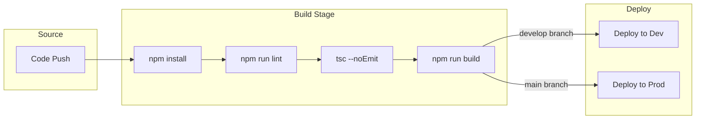

# CustomCoachPro - Deployment Guide

**Author:** Susheel Bhatt  
**Contact:** s.susheel9@gmail.com

---

## Table of Contents

1. [Local Development Setup](#local-development-setup)
2. [Environment Configuration](#environment-configuration)
3. [Azure DevOps CI/CD](#azure-devops-cicd)
4. [Azure Static Web Apps](#azure-static-web-apps)
5. [Database Migrations](#database-migrations)
6. [Edge Function Deployment](#edge-function-deployment)
7. [Production Checklist](#production-checklist)
8. [Troubleshooting](#troubleshooting)

---

## Local Development Setup

### Prerequisites

| Requirement | Version | Purpose |
|-------------|---------|---------|
| Node.js | 20.x or later | JavaScript runtime |
| npm | 10.x or later | Package manager |
| Git | Latest | Version control |

### Step 1: Clone Repository

```bash
git clone <repository-url>
cd customcoachpro
```

### Step 2: Install Dependencies

```bash
npm install
```

### Step 3: Environment Variables

The `.env` file is auto-generated and contains:

```env
VITE_SUPABASE_URL=https://your-project.supabase.co
VITE_SUPABASE_PUBLISHABLE_KEY=your-anon-key
VITE_SUPABASE_PROJECT_ID=your-project-id
```

**Note:** Do not edit `.env` manually - it's managed by the platform.

### Step 4: Start Development Server

```bash
npm run dev
```

The app will be available at `http://localhost:5173`.

### Step 5: Build for Production

```bash
npm run build
```

Output will be in the `dist/` directory.

### Available Scripts

| Script | Command | Description |
|--------|---------|-------------|
| `dev` | `npm run dev` | Start development server |
| `build` | `npm run build` | Production build |
| `preview` | `npm run preview` | Preview production build |
| `lint` | `npm run lint` | Run ESLint |

---

## Environment Configuration

### Development vs Production

| Variable | Development | Production |
|----------|-------------|------------|
| `VITE_SUPABASE_URL` | Same project | Same project |
| `VITE_SUPABASE_PUBLISHABLE_KEY` | Anon key | Anon key |

### Edge Function Secrets

Configure these in the platform secrets management:

| Secret | Service | Required For |
|--------|---------|--------------|
| `RESEND_API_KEY` | Resend | Client invitations |
| `AZURE_STORAGE_ACCOUNT_NAME` | Azure | Photo uploads |
| `AZURE_STORAGE_ACCOUNT_KEY` | Azure | Photo uploads |
| `AZURE_STORAGE_CONTAINER_NAME` | Azure | Photo uploads |

---

## Azure DevOps CI/CD

### Pipeline Overview



### Main Pipeline Configuration

**File:** `azure-pipelines.yml`

```yaml
trigger:
  branches:
    include:
      - main
      - develop

pr:
  branches:
    include:
      - main

pool:
  vmImage: 'ubuntu-latest'

variables:
  - group: CustomCoachPro-Variables
  - name: nodeVersion
    value: '20.x'
  - name: buildOutputPath
    value: 'dist'

stages:
  # Build Stage
  - stage: Build
    displayName: 'Build Application'
    jobs:
      - job: BuildJob
        displayName: 'Build'
        steps:
          - task: NodeTool@0
            inputs:
              versionSpec: $(nodeVersion)
            displayName: 'Install Node.js'

          - script: npm ci
            displayName: 'Install dependencies'

          - script: npm run build
            displayName: 'Build application'
            env:
              VITE_SUPABASE_URL: $(VITE_SUPABASE_URL)
              VITE_SUPABASE_PUBLISHABLE_KEY: $(VITE_SUPABASE_PUBLISHABLE_KEY)

          - script: npm run lint
            displayName: 'Run linting'
            continueOnError: true

          - task: PublishBuildArtifacts@1
            inputs:
              PathtoPublish: $(buildOutputPath)
              ArtifactName: 'webapp'
            displayName: 'Publish artifacts'

  # Deploy to Development
  - stage: DeployDev
    displayName: 'Deploy to Development'
    dependsOn: Build
    condition: and(succeeded(), eq(variables['Build.SourceBranch'], 'refs/heads/develop'))
    jobs:
      - deployment: DeployDev
        displayName: 'Deploy to Dev Environment'
        environment: 'development'
        strategy:
          runOnce:
            deploy:
              steps:
                - download: current
                  artifact: webapp

                - task: AzureStaticWebApp@0
                  inputs:
                    app_location: '$(Pipeline.Workspace)/webapp'
                    skip_app_build: true
                    azure_static_web_apps_api_token: $(AZURE_STATIC_WEB_APPS_API_TOKEN_DEV)

  # Deploy to Production
  - stage: DeployProd
    displayName: 'Deploy to Production'
    dependsOn: Build
    condition: and(succeeded(), eq(variables['Build.SourceBranch'], 'refs/heads/main'))
    jobs:
      - deployment: DeployProd
        displayName: 'Deploy to Production'
        environment: 'production'
        strategy:
          runOnce:
            deploy:
              steps:
                - download: current
                  artifact: webapp

                - task: AzureStaticWebApp@0
                  inputs:
                    app_location: '$(Pipeline.Workspace)/webapp'
                    skip_app_build: true
                    azure_static_web_apps_api_token: $(AZURE_STATIC_WEB_APPS_API_TOKEN_PROD)
```

### Variable Group Setup

Create a variable group named `CustomCoachPro-Variables` in Azure DevOps:

| Variable | Type | Description |
|----------|------|-------------|
| `VITE_SUPABASE_URL` | Plain | Backend URL |
| `VITE_SUPABASE_PUBLISHABLE_KEY` | Plain | Public API key |
| `AZURE_STATIC_WEB_APPS_API_TOKEN_DEV` | Secret | SWA dev token |
| `AZURE_STATIC_WEB_APPS_API_TOKEN_PROD` | Secret | SWA prod token |

### PR Validation Pipeline

**File:** `.azure/azure-pipelines-pr.yml`

```yaml
trigger: none

pr:
  branches:
    include:
      - main
      - develop

pool:
  vmImage: 'ubuntu-latest'

variables:
  nodeVersion: '20.x'

jobs:
  - job: Validate
    displayName: 'Validate Pull Request'
    steps:
      - task: NodeTool@0
        inputs:
          versionSpec: $(nodeVersion)
        displayName: 'Install Node.js'

      - script: npm ci
        displayName: 'Install dependencies'

      - script: npm run lint
        displayName: 'Run ESLint'

      - script: npx tsc --noEmit
        displayName: 'TypeScript type check'

      - script: npm run build
        displayName: 'Verify build succeeds'
        env:
          VITE_SUPABASE_URL: 'https://placeholder.supabase.co'
          VITE_SUPABASE_PUBLISHABLE_KEY: 'placeholder-key'
```

### Creating Environments

1. Go to Azure DevOps → Pipelines → Environments
2. Create `development` environment
3. Create `production` environment with approval gates

---

## Azure Static Web Apps

### Creating SWA Resources

1. Go to Azure Portal
2. Create Resource → Static Web App
3. Configure:
   - Name: `customcoachpro-dev` or `customcoachpro-prod`
   - Plan: Free or Standard
   - Region: Closest to users
   - Build: Skip (handled by pipeline)

### Getting Deployment Tokens

1. Go to Static Web App resource
2. Overview → Manage deployment token
3. Copy token
4. Add to Azure DevOps variable group

### Custom Domain Setup

1. Go to Static Web App → Custom domains
2. Add custom domain
3. Configure DNS:
   - For apex domain: Add A record pointing to SWA IP
   - For subdomain: Add CNAME pointing to SWA hostname

---

## Database Migrations

### Migration File Location

```
supabase/migrations/
├── 20240101000000_initial_schema.sql
├── 20240115000000_add_indexes.sql
└── ... more migrations
```

### Migration Naming Convention

```
YYYYMMDDHHMMSS_description.sql
```

Example: `20240315143022_add_notification_preferences.sql`

### Creating Migrations

Migrations are created through the platform's database tools. SQL changes are written and applied through the migration interface.

### Migration Best Practices

1. **Atomic Changes** - Each migration should be self-contained
2. **Rollback Ready** - Consider how to reverse changes
3. **RLS Policies** - Always include security policies
4. **Indexes** - Add indexes for frequently queried columns

---

## Edge Function Deployment

### Automatic Deployment

Edge functions deploy automatically when code is pushed to the repository.

**Function Location:**
```
supabase/functions/
├── send-client-invitation/
│   └── index.ts
└── upload-progress-photo/
    └── index.ts
```

### Verifying Deployment

After pushing code:
1. Check function logs in the platform
2. Test function endpoint
3. Verify response format

### Rollback

To rollback a function:
1. Revert the code change in Git
2. Push the reverted code
3. Function will redeploy with previous version

---

## Production Checklist

### Pre-Deployment

- [ ] All tests passing
- [ ] Linting passing
- [ ] Build succeeds locally
- [ ] Environment variables configured
- [ ] Secrets configured for edge functions
- [ ] Database migrations applied
- [ ] RLS policies verified

### Security

- [ ] All tables have RLS enabled
- [ ] Policies cover all operations (SELECT, INSERT, UPDATE, DELETE)
- [ ] No sensitive data exposed in client code
- [ ] API keys stored in secrets (not code)
- [ ] CORS configured appropriately

### Performance

- [ ] Images optimized
- [ ] Code splitting enabled (automatic with Vite)
- [ ] Database indexes in place
- [ ] Caching headers configured

### Monitoring

- [ ] Error logging enabled
- [ ] Function logs accessible
- [ ] Database query monitoring
- [ ] Uptime monitoring configured

---

## Troubleshooting

### Build Failures

**Issue:** `Module not found`
```
Solution: Run `npm install` and check import paths
```

**Issue:** TypeScript errors
```
Solution: Run `npx tsc --noEmit` locally to see all errors
```

**Issue:** Environment variable missing
```
Solution: Ensure variable is in Azure DevOps variable group
```

### Deployment Failures

**Issue:** SWA deployment timeout
```
Solution: Check deployment token is valid
Regenerate token if needed
```

**Issue:** 404 after deployment
```
Solution: Ensure staticwebapp.config.json exists with:
{
  "navigationFallback": {
    "rewrite": "/index.html"
  }
}
```

### Edge Function Issues

**Issue:** Function returns 500
```
Solution: Check function logs for error details
Verify all secrets are configured
```

**Issue:** CORS errors
```
Solution: Ensure corsHeaders are included in response
Check OPTIONS handler exists
```

### Database Issues

**Issue:** RLS policy blocking access
```
Solution: Verify user is authenticated
Check policy conditions match expected user state
```

**Issue:** Migration failed
```
Solution: Check SQL syntax
Ensure dependent objects exist
Review error in migration logs
```

---

*For questions, contact Susheel Bhatt at s.susheel9@gmail.com*
