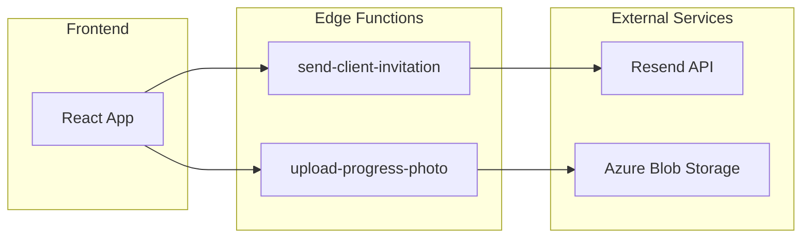

# CustomCoachPro - Edge Functions

**Author:** Susheel Bhatt  
**Contact:** s.susheel9@gmail.com

---

## Table of Contents

1. [Overview](#overview)
2. [Function Inventory](#function-inventory)
3. [send-client-invitation](#send-client-invitation)
4. [upload-progress-photo](#upload-progress-photo)
5. [Creating New Functions](#creating-new-functions)
6. [Testing Functions](#testing-functions)
7. [Common Patterns](#common-patterns)

---

## Overview

CustomCoachPro uses Supabase Edge Functions for serverless backend logic. These functions run on Deno runtime and deploy automatically.

### Architecture



### Key Characteristics

| Feature | Description |
|---------|-------------|
| Runtime | Deno |
| Deployment | Automatic on code push |
| Timeout | 60 seconds default |
| Memory | 150MB default |
| Secrets | Managed via platform secrets |

---

## Function Inventory

| Function | Purpose | External Dependencies |
|----------|---------|----------------------|
| `send-client-invitation` | Send email invitations | Resend API |
| `upload-progress-photo` | Upload photos to cloud storage | Azure Blob Storage |

---

## send-client-invitation

### Purpose

Sends personalized email invitations to prospective clients on behalf of coaches.

### Location

```
supabase/functions/send-client-invitation/index.ts
```

### Endpoint

```
POST /functions/v1/send-client-invitation
```

### Required Secrets

| Secret | Description |
|--------|-------------|
| `RESEND_API_KEY` | Resend API key for sending emails |

### Request Format

```typescript
interface InvitationRequest {
  email: string;      // Client email address
  name: string;       // Client name
  message?: string;   // Optional personal message
  coachId: string;    // Coach's user ID
  coachName: string;  // Coach's display name
}
```

### Response Format

**Success (200):**
```json
{
  "success": true,
  "message": "Invitation sent successfully",
  "data": {
    "id": "email-id-from-resend"
  }
}
```

**Error (500):**
```json
{
  "error": "Error message"
}
```

### Implementation Details

```typescript
import { serve } from "https://deno.land/std@0.168.0/http/server.ts";

const corsHeaders = {
  'Access-Control-Allow-Origin': '*',
  'Access-Control-Allow-Headers': 'authorization, x-client-info, apikey, content-type',
};

interface InvitationRequest {
  email: string;
  name: string;
  message?: string;
  coachId: string;
  coachName: string;
}

serve(async (req) => {
  // Handle CORS preflight
  if (req.method === 'OPTIONS') {
    return new Response(null, { headers: corsHeaders });
  }

  try {
    const { email, name, message, coachId, coachName }: InvitationRequest = 
      await req.json();

    // Validate required fields
    if (!email || !name || !coachId) {
      return new Response(
        JSON.stringify({ error: 'Missing required fields' }),
        { status: 400, headers: { ...corsHeaders, 'Content-Type': 'application/json' } }
      );
    }

    // Check for API key
    const resendApiKey = Deno.env.get('RESEND_API_KEY');
    if (!resendApiKey) {
      console.log('Email not configured, logging invitation:', { email, name, coachName });
      return new Response(
        JSON.stringify({ success: true, message: 'Logged (email not configured)' }),
        { headers: { ...corsHeaders, 'Content-Type': 'application/json' } }
      );
    }

    // Build signup URL
    const baseUrl = Deno.env.get('SITE_URL') || 'https://customcoachpro.com';
    const signupUrl = `${baseUrl}/signup?ref=${coachId}`;

    // Send email via Resend
    const response = await fetch('https://api.resend.com/emails', {
      method: 'POST',
      headers: {
        'Authorization': `Bearer ${resendApiKey}`,
        'Content-Type': 'application/json',
      },
      body: JSON.stringify({
        from: 'CustomCoachPro <noreply@customcoachpro.com>',
        to: email,
        subject: `${coachName} has invited you to CustomCoachPro`,
        html: `
          <h2>You've been invited!</h2>
          <p>Hi ${name},</p>
          <p>${coachName} would like to be your fitness coach on CustomCoachPro.</p>
          ${message ? `<p><em>"${message}"</em></p>` : ''}
          <p><a href="${signupUrl}">Click here to get started</a></p>
          <p>Best,<br>The CustomCoachPro Team</p>
        `,
      }),
    });

    const result = await response.json();

    if (!response.ok) {
      throw new Error(result.message || 'Failed to send email');
    }

    return new Response(
      JSON.stringify({ success: true, message: 'Invitation sent', data: result }),
      { headers: { ...corsHeaders, 'Content-Type': 'application/json' } }
    );

  } catch (error) {
    return new Response(
      JSON.stringify({ error: error.message }),
      { status: 500, headers: { ...corsHeaders, 'Content-Type': 'application/json' } }
    );
  }
});
```

### Frontend Usage

```typescript
import { supabase } from '@/integrations/supabase/client';

export async function sendClientInvitation(data: InvitationData) {
  const { data: result, error } = await supabase.functions.invoke(
    'send-client-invitation',
    {
      body: data,
    }
  );

  if (error) throw error;
  return result;
}

// In component
const handleInvite = async () => {
  try {
    await sendClientInvitation({
      email: 'client@example.com',
      name: 'John Doe',
      message: 'Looking forward to working with you!',
      coachId: user.id,
      coachName: user.fullName,
    });
    toast({ title: 'Invitation sent!' });
  } catch (error) {
    toast({ title: 'Failed to send', variant: 'destructive' });
  }
};
```

---

## upload-progress-photo

### Purpose

Uploads client progress photos to Azure Blob Storage and returns the public URL.

### Location

```
supabase/functions/upload-progress-photo/index.ts
```

### Endpoint

```
POST /functions/v1/upload-progress-photo
```

### Required Secrets

| Secret | Description |
|--------|-------------|
| `AZURE_STORAGE_ACCOUNT_NAME` | Azure storage account name |
| `AZURE_STORAGE_ACCOUNT_KEY` | Azure storage account key |
| `AZURE_STORAGE_CONTAINER_NAME` | Container for progress photos |

### Request Format

```
Content-Type: multipart/form-data

Fields:
- file: File (image)
- clientId: string
- poseType: 'front' | 'back' | 'side'
```

### Response Format

**Success (200):**
```json
{
  "success": true,
  "photoUrl": "https://storage.blob.core.windows.net/...",
  "blobName": "client-id/timestamp-front.jpg"
}
```

**Error (500):**
```json
{
  "error": "Error message"
}
```

### Implementation Details

```typescript
import { serve } from "https://deno.land/std@0.168.0/http/server.ts";
import { encode as base64Encode } from "https://deno.land/std@0.168.0/encoding/base64.ts";

const corsHeaders = {
  'Access-Control-Allow-Origin': '*',
  'Access-Control-Allow-Headers': 'authorization, x-client-info, apikey, content-type',
};

serve(async (req) => {
  if (req.method === 'OPTIONS') {
    return new Response(null, { headers: corsHeaders });
  }

  try {
    // Get Azure credentials
    const accountName = Deno.env.get('AZURE_STORAGE_ACCOUNT_NAME');
    const accountKey = Deno.env.get('AZURE_STORAGE_ACCOUNT_KEY');
    const containerName = Deno.env.get('AZURE_STORAGE_CONTAINER_NAME');

    if (!accountName || !accountKey || !containerName) {
      throw new Error('Azure Storage not configured');
    }

    // Parse form data
    const formData = await req.formData();
    const file = formData.get('file') as File;
    const clientId = formData.get('clientId') as string;
    const poseType = formData.get('poseType') as string;

    if (!file || !clientId || !poseType) {
      return new Response(
        JSON.stringify({ error: 'Missing required fields' }),
        { status: 400, headers: { ...corsHeaders, 'Content-Type': 'application/json' } }
      );
    }

    // Generate unique blob name
    const timestamp = Date.now();
    const extension = file.name.split('.').pop();
    const blobName = `${clientId}/${timestamp}-${poseType}.${extension}`;

    // Create Azure Blob Storage URL
    const blobUrl = `https://${accountName}.blob.core.windows.net/${containerName}/${blobName}`;

    // Create authorization header (Shared Key)
    const date = new Date().toUTCString();
    const contentLength = file.size;
    const contentType = file.type;

    // Build string to sign
    const stringToSign = [
      'PUT',
      '', // Content-Encoding
      '', // Content-Language
      contentLength,
      '', // Content-MD5
      contentType,
      '', // Date
      '', // If-Modified-Since
      '', // If-Match
      '', // If-None-Match
      '', // If-Unmodified-Since
      '', // Range
      `x-ms-blob-type:BlockBlob`,
      `x-ms-date:${date}`,
      `x-ms-version:2020-10-02`,
      `/${accountName}/${containerName}/${blobName}`,
    ].join('\n');

    // Sign with HMAC-SHA256
    const key = Uint8Array.from(atob(accountKey), c => c.charCodeAt(0));
    const encoder = new TextEncoder();
    const data = encoder.encode(stringToSign);
    
    const cryptoKey = await crypto.subtle.importKey(
      'raw', key, { name: 'HMAC', hash: 'SHA-256' }, false, ['sign']
    );
    const signature = await crypto.subtle.sign('HMAC', cryptoKey, data);
    const signatureBase64 = base64Encode(new Uint8Array(signature));

    // Upload to Azure
    const fileBuffer = await file.arrayBuffer();
    const uploadResponse = await fetch(blobUrl, {
      method: 'PUT',
      headers: {
        'x-ms-blob-type': 'BlockBlob',
        'x-ms-date': date,
        'x-ms-version': '2020-10-02',
        'Content-Type': contentType,
        'Content-Length': contentLength.toString(),
        'Authorization': `SharedKey ${accountName}:${signatureBase64}`,
      },
      body: fileBuffer,
    });

    if (!uploadResponse.ok) {
      const errorText = await uploadResponse.text();
      throw new Error(`Upload failed: ${errorText}`);
    }

    return new Response(
      JSON.stringify({
        success: true,
        photoUrl: blobUrl,
        blobName: blobName,
      }),
      { headers: { ...corsHeaders, 'Content-Type': 'application/json' } }
    );

  } catch (error) {
    return new Response(
      JSON.stringify({ error: error.message }),
      { status: 500, headers: { ...corsHeaders, 'Content-Type': 'application/json' } }
    );
  }
});
```

### Frontend Usage

```typescript
import { supabase } from '@/integrations/supabase/client';

export async function uploadProgressPhoto(
  file: File,
  clientId: string,
  poseType: 'front' | 'back' | 'side'
) {
  const formData = new FormData();
  formData.append('file', file);
  formData.append('clientId', clientId);
  formData.append('poseType', poseType);

  const { data, error } = await supabase.functions.invoke(
    'upload-progress-photo',
    {
      body: formData,
    }
  );

  if (error) throw error;
  return data;
}

// In component
const handlePhotoUpload = async (file: File) => {
  try {
    const result = await uploadProgressPhoto(file, user.id, 'front');
    
    // Save to database
    await supabase.from('progress_photos').insert({
      client_id: user.id,
      photo_url: result.photoUrl,
      pose_type: 'front',
    });
    
    toast({ title: 'Photo uploaded!' });
  } catch (error) {
    toast({ title: 'Upload failed', variant: 'destructive' });
  }
};
```

---

## Creating New Functions

### Step 1: Create Directory

```bash
supabase/functions/my-new-function/index.ts
```

### Step 2: Basic Template

```typescript
import { serve } from "https://deno.land/std@0.168.0/http/server.ts";

const corsHeaders = {
  'Access-Control-Allow-Origin': '*',
  'Access-Control-Allow-Headers': 'authorization, x-client-info, apikey, content-type',
};

serve(async (req) => {
  // Handle CORS
  if (req.method === 'OPTIONS') {
    return new Response(null, { headers: corsHeaders });
  }

  try {
    // Parse request body
    const body = await req.json();

    // Your logic here
    const result = { message: 'Success' };

    return new Response(
      JSON.stringify(result),
      { 
        headers: { 
          ...corsHeaders, 
          'Content-Type': 'application/json' 
        } 
      }
    );

  } catch (error) {
    return new Response(
      JSON.stringify({ error: error.message }),
      { 
        status: 500, 
        headers: { 
          ...corsHeaders, 
          'Content-Type': 'application/json' 
        } 
      }
    );
  }
});
```

### Step 3: Add Required Secrets

Use the platform secrets management to add any required API keys or credentials.

### Step 4: Deploy

Functions deploy automatically when code is pushed.

---

## Testing Functions

### Using Supabase Client

```typescript
const { data, error } = await supabase.functions.invoke('function-name', {
  body: { key: 'value' },
});
```

### Using cURL

```bash
curl -X POST https://your-project.supabase.co/functions/v1/function-name \
  -H "Authorization: Bearer YOUR_ANON_KEY" \
  -H "Content-Type: application/json" \
  -d '{"key": "value"}'
```

### Viewing Logs

Check edge function logs in the platform for debugging.

---

## Common Patterns

### Authenticated Requests

```typescript
import { createClient } from 'https://esm.sh/@supabase/supabase-js@2';

serve(async (req) => {
  // Get auth header
  const authHeader = req.headers.get('Authorization');
  if (!authHeader) {
    return new Response('Unauthorized', { status: 401 });
  }

  // Create authenticated client
  const supabase = createClient(
    Deno.env.get('SUPABASE_URL')!,
    Deno.env.get('SUPABASE_ANON_KEY')!,
    {
      global: {
        headers: { Authorization: authHeader },
      },
    }
  );

  // Get user
  const { data: { user }, error } = await supabase.auth.getUser();
  if (error || !user) {
    return new Response('Unauthorized', { status: 401 });
  }

  // User is authenticated, proceed...
});
```

### Database Access

```typescript
import { createClient } from 'https://esm.sh/@supabase/supabase-js@2';

serve(async (req) => {
  const supabase = createClient(
    Deno.env.get('SUPABASE_URL')!,
    Deno.env.get('SUPABASE_SERVICE_ROLE_KEY')! // Use service role for admin access
  );

  const { data, error } = await supabase
    .from('table_name')
    .select('*')
    .eq('column', 'value');

  if (error) throw error;

  return new Response(JSON.stringify(data), {
    headers: { 'Content-Type': 'application/json' },
  });
});
```

### Webhook Handler

```typescript
serve(async (req) => {
  // Verify webhook signature
  const signature = req.headers.get('x-webhook-signature');
  const body = await req.text();
  
  const expectedSignature = await computeSignature(body);
  if (signature !== expectedSignature) {
    return new Response('Invalid signature', { status: 401 });
  }

  // Process webhook
  const payload = JSON.parse(body);
  // Handle event...

  return new Response('OK', { status: 200 });
});
```

---

*For questions, contact Susheel Bhatt at s.susheel9@gmail.com*
