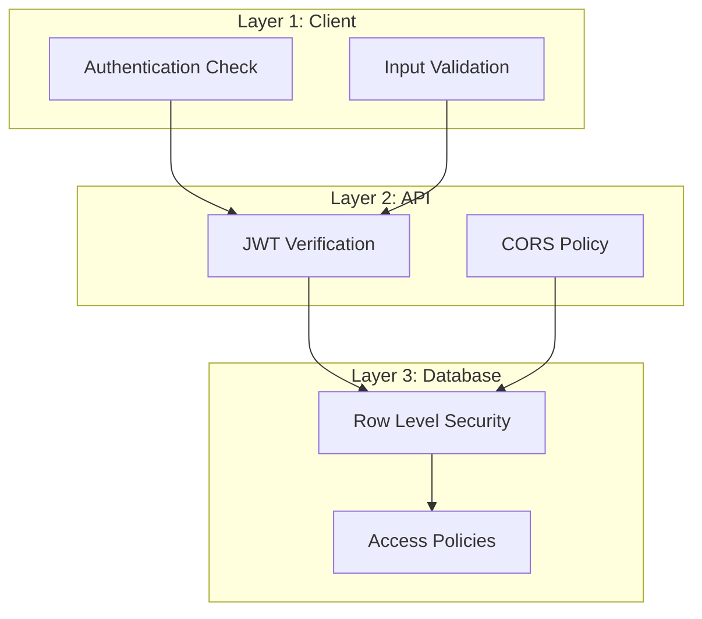
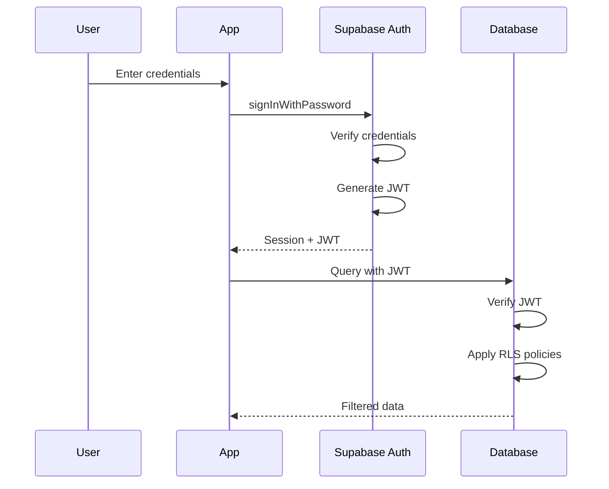

# CustomCoachPro - Security & Row Level Security

**Author:** Susheel Bhatt  
**Contact:** s.susheel9@gmail.com

---

## Table of Contents

1. [Security Overview](#security-overview)
2. [Authentication Security](#authentication-security)
3. [Row Level Security (RLS)](#row-level-security-rls)
4. [Policy Patterns](#policy-patterns)
5. [Table-Specific Policies](#table-specific-policies)
6. [API Security](#api-security)
7. [Best Practices](#best-practices)
8. [Security Audit Checklist](#security-audit-checklist)

---

## Security Overview

### Defense in Depth

CustomCoachPro implements multiple security layers:



### Security Principles

1. **Least Privilege** - Users only access what they need
2. **Defense in Depth** - Multiple security layers
3. **Fail Secure** - Default to denying access
4. **Input Validation** - Validate all user input
5. **Secure by Default** - RLS enabled on all tables

---

## Authentication Security

### Authentication Flow



### JWT Token Structure

```json
{
  "aud": "authenticated",
  "exp": 1234567890,
  "sub": "user-uuid",
  "email": "user@example.com",
  "role": "authenticated",
  "app_metadata": {},
  "user_metadata": {}
}
```

### Session Management

- **Token Expiry:** 1 hour by default
- **Refresh Token:** Automatic refresh before expiry
- **Secure Storage:** Tokens stored in secure HTTP-only context

### Password Security

- **Minimum Length:** 6 characters (configurable)
- **Hashing:** bcrypt with salt
- **Reset Flow:** Email-based password reset

---

## Row Level Security (RLS)

### What is RLS?

Row Level Security is a PostgreSQL feature that restricts which rows users can access in database tables. It acts as a filter on all queries.

### How RLS Works

```sql
-- Without RLS: User sees all rows
SELECT * FROM profiles; -- Returns 1000 rows

-- With RLS: User sees only their own
SELECT * FROM profiles; -- Returns 1 row (their own)
```

### Enabling RLS

```sql
-- Enable RLS on a table
ALTER TABLE public.profiles ENABLE ROW LEVEL SECURITY;

-- Force RLS for table owner too
ALTER TABLE public.profiles FORCE ROW LEVEL SECURITY;
```

### RLS Policy Anatomy

```sql
CREATE POLICY "policy_name"
ON public.table_name
FOR operation -- SELECT, INSERT, UPDATE, DELETE, ALL
TO role -- authenticated, anon, public
USING (condition) -- For SELECT, UPDATE, DELETE
WITH CHECK (condition); -- For INSERT, UPDATE
```

---

## Policy Patterns

### Pattern 1: User Owns Data

Users can only access their own data.

```sql
-- User can view their own profile
CREATE POLICY "Users can view own profile"
ON public.profiles
FOR SELECT
TO authenticated
USING (auth.uid() = user_id);

-- User can update their own profile
CREATE POLICY "Users can update own profile"
ON public.profiles
FOR UPDATE
TO authenticated
USING (auth.uid() = user_id)
WITH CHECK (auth.uid() = user_id);
```

### Pattern 2: Coach-Client Relationship

Coaches can access their clients' data.

```sql
-- Coach can view client measurements
CREATE POLICY "Coach can view client measurements"
ON public.client_measurements
FOR SELECT
TO authenticated
USING (
  client_id = auth.uid() -- Own data
  OR 
  EXISTS (
    SELECT 1 FROM public.coach_client_relationships
    WHERE coach_id = auth.uid()
    AND client_id = client_measurements.client_id
    AND status = 'active'
  )
);
```

### Pattern 3: System Content

System-provided content is viewable by all authenticated users.

```sql
-- Anyone can view system exercises
CREATE POLICY "View system exercises"
ON public.exercises
FOR SELECT
TO authenticated
USING (
  is_system = true
  OR created_by = auth.uid()
);
```

### Pattern 4: Role-Based Access

Access based on user role.

```sql
-- Only coaches can create workout templates
CREATE POLICY "Coaches can create templates"
ON public.workout_templates
FOR INSERT
TO authenticated
WITH CHECK (
  EXISTS (
    SELECT 1 FROM public.user_roles
    WHERE user_id = auth.uid()
    AND role IN ('coach', 'super_admin')
  )
);
```

### Pattern 5: Insert with Ownership

Ensure user sets themselves as owner on insert.

```sql
-- User must set themselves as owner
CREATE POLICY "User creates own goals"
ON public.client_goals
FOR INSERT
TO authenticated
WITH CHECK (client_id = auth.uid());
```

---

## Table-Specific Policies

### profiles

```sql
-- View own profile
CREATE POLICY "Users view own profile"
ON public.profiles FOR SELECT
USING (auth.uid() = user_id);

-- Update own profile
CREATE POLICY "Users update own profile"
ON public.profiles FOR UPDATE
USING (auth.uid() = user_id);

-- Insert own profile
CREATE POLICY "Users insert own profile"
ON public.profiles FOR INSERT
WITH CHECK (auth.uid() = user_id);
```

### user_roles

```sql
-- View own roles
CREATE POLICY "Users view own roles"
ON public.user_roles FOR SELECT
USING (auth.uid() = user_id);

-- Only system can insert roles
-- (handled by triggers on signup)
```

### client_profiles

```sql
-- Client views own profile
CREATE POLICY "Client views own profile"
ON public.client_profiles FOR SELECT
USING (auth.uid() = user_id);

-- Coach views assigned clients
CREATE POLICY "Coach views client profiles"
ON public.client_profiles FOR SELECT
USING (
  EXISTS (
    SELECT 1 FROM public.coach_client_relationships
    WHERE coach_id = auth.uid()
    AND client_id = client_profiles.user_id
    AND status = 'active'
  )
);

-- Client updates own profile
CREATE POLICY "Client updates own profile"
ON public.client_profiles FOR UPDATE
USING (auth.uid() = user_id);
```

### coach_profiles

```sql
-- Anyone can view coach profiles (for marketplace)
CREATE POLICY "Public coach profiles"
ON public.coach_profiles FOR SELECT
TO authenticated
USING (true);

-- Coaches update own profile
CREATE POLICY "Coach updates own profile"
ON public.coach_profiles FOR UPDATE
USING (auth.uid() = user_id);
```

### coach_client_relationships

```sql
-- Coach and client can view their relationships
CREATE POLICY "View own relationships"
ON public.coach_client_relationships FOR SELECT
USING (
  auth.uid() = coach_id 
  OR auth.uid() = client_id
);

-- Coach can update relationship status
CREATE POLICY "Coach updates relationship"
ON public.coach_client_relationships FOR UPDATE
USING (auth.uid() = coach_id);
```

### client_measurements

```sql
-- Client views own measurements
CREATE POLICY "Client views own measurements"
ON public.client_measurements FOR SELECT
USING (auth.uid() = client_id);

-- Coach views client measurements
CREATE POLICY "Coach views client measurements"
ON public.client_measurements FOR SELECT
USING (
  EXISTS (
    SELECT 1 FROM public.coach_client_relationships
    WHERE coach_id = auth.uid()
    AND client_id = client_measurements.client_id
    AND status = 'active'
  )
);

-- Client inserts own measurements
CREATE POLICY "Client adds measurements"
ON public.client_measurements FOR INSERT
WITH CHECK (auth.uid() = client_id);
```

### workout_templates

```sql
-- View system templates or own templates
CREATE POLICY "View templates"
ON public.workout_templates FOR SELECT
USING (
  is_system = true 
  OR created_by = auth.uid()
);

-- Coaches/admins create templates
CREATE POLICY "Create templates"
ON public.workout_templates FOR INSERT
WITH CHECK (
  created_by = auth.uid()
  AND EXISTS (
    SELECT 1 FROM public.user_roles
    WHERE user_id = auth.uid()
    AND role IN ('coach', 'super_admin')
  )
);

-- Creator can update
CREATE POLICY "Update own templates"
ON public.workout_templates FOR UPDATE
USING (created_by = auth.uid());

-- Creator can delete
CREATE POLICY "Delete own templates"
ON public.workout_templates FOR DELETE
USING (created_by = auth.uid() AND is_system = false);
```

### plan_assignments

```sql
-- Client views own assignments
CREATE POLICY "Client views assignments"
ON public.plan_assignments FOR SELECT
USING (auth.uid() = client_id);

-- Coach views their assignments
CREATE POLICY "Coach views assignments"
ON public.plan_assignments FOR SELECT
USING (auth.uid() = coach_id);

-- Coach creates assignments
CREATE POLICY "Coach creates assignments"
ON public.plan_assignments FOR INSERT
WITH CHECK (
  auth.uid() = coach_id
  AND EXISTS (
    SELECT 1 FROM public.coach_client_relationships
    WHERE coach_id = auth.uid()
    AND client_id = plan_assignments.client_id
    AND status = 'active'
  )
);
```

### messages

```sql
-- View messages where user is sender or recipient
CREATE POLICY "View own messages"
ON public.messages FOR SELECT
USING (
  auth.uid() = sender_id 
  OR auth.uid() = recipient_id
);

-- User can send messages
CREATE POLICY "Send messages"
ON public.messages FOR INSERT
WITH CHECK (auth.uid() = sender_id);

-- Recipient can mark as read
CREATE POLICY "Mark messages read"
ON public.messages FOR UPDATE
USING (auth.uid() = recipient_id);
```

### notifications

```sql
-- View own notifications
CREATE POLICY "View own notifications"
ON public.notifications FOR SELECT
USING (auth.uid() = user_id);

-- System creates notifications
-- (handled by triggers/functions)

-- User can mark own as read
CREATE POLICY "Update own notifications"
ON public.notifications FOR UPDATE
USING (auth.uid() = user_id);
```

---

## API Security

### CORS Configuration

Edge functions include CORS headers:

```typescript
const corsHeaders = {
  'Access-Control-Allow-Origin': '*',
  'Access-Control-Allow-Headers': 'authorization, x-client-info, apikey, content-type',
};
```

**Production Recommendation:** Restrict `Access-Control-Allow-Origin` to specific domains.

### API Key Security

- **Anon Key:** Used for unauthenticated requests (public data)
- **Service Role Key:** Never exposed to client, only in edge functions
- **User JWT:** Attached to all authenticated requests

### Request Validation

```typescript
// Validate required fields
if (!email || !name) {
  return new Response(
    JSON.stringify({ error: 'Missing required fields' }),
    { status: 400 }
  );
}

// Validate email format
const emailRegex = /^[^\s@]+@[^\s@]+\.[^\s@]+$/;
if (!emailRegex.test(email)) {
  return new Response(
    JSON.stringify({ error: 'Invalid email format' }),
    { status: 400 }
  );
}
```

---

## Best Practices

### Policy Development

1. **Start restrictive** - Begin with no access, add policies as needed
2. **Test thoroughly** - Test as different user roles
3. **Use helper functions** - Create reusable SQL functions
4. **Document policies** - Comment on policy purpose

### Helper Functions

```sql
-- Check if user is coach of client
CREATE OR REPLACE FUNCTION public.is_coach_of_client(
  _client_id uuid,
  _coach_id uuid
)
RETURNS boolean AS $$
BEGIN
  RETURN EXISTS (
    SELECT 1 FROM public.coach_client_relationships
    WHERE coach_id = _coach_id
    AND client_id = _client_id
    AND status = 'active'
  );
END;
$$ LANGUAGE plpgsql SECURITY DEFINER;

-- Usage in policy
CREATE POLICY "Coach accesses client data"
ON public.some_table FOR SELECT
USING (
  is_coach_of_client(client_id, auth.uid())
);
```

### Common Pitfalls

1. **Forgetting RLS on new tables** - Always enable RLS
2. **Overly permissive policies** - Avoid `USING (true)` unless intended
3. **Missing DELETE policies** - Remember to restrict deletions
4. **Not testing as different roles** - Always test multi-role scenarios

---

## Security Audit Checklist

### Authentication

- [ ] Password requirements enforced
- [ ] Session expiry configured
- [ ] Password reset flow secure
- [ ] No sensitive data in tokens

### Database

- [ ] RLS enabled on ALL tables
- [ ] Policies cover SELECT, INSERT, UPDATE, DELETE
- [ ] No overly permissive policies
- [ ] Service role key not exposed
- [ ] Sensitive columns protected

### API

- [ ] All endpoints require authentication (except public)
- [ ] Input validation on all endpoints
- [ ] Error messages don't leak info
- [ ] CORS properly configured
- [ ] Rate limiting considered

### Client

- [ ] No secrets in client code
- [ ] No sensitive data logged
- [ ] XSS prevention (React handles)
- [ ] CSRF prevention (token-based auth)

### Infrastructure

- [ ] HTTPS enforced
- [ ] Secrets managed properly
- [ ] Backups configured
- [ ] Audit logging enabled

---

## Testing RLS Policies

### Manual Testing

```sql
-- Test as specific user
SET LOCAL ROLE authenticated;
SET LOCAL request.jwt.claims = '{"sub": "user-uuid-here"}';

-- Run query
SELECT * FROM profiles;

-- Reset
RESET ROLE;
RESET request.jwt.claims;
```

### Automated Testing

```typescript
// Test that user can only see own data
test('user sees only own profile', async () => {
  const { data } = await supabase
    .from('profiles')
    .select('*');
  
  expect(data).toHaveLength(1);
  expect(data[0].user_id).toBe(currentUserId);
});

// Test that coach can see client data
test('coach sees client data', async () => {
  const { data } = await supabase
    .from('client_measurements')
    .select('*')
    .eq('client_id', clientId);
  
  expect(data).not.toBeNull();
});
```

---

*For questions, contact Susheel Bhatt at s.susheel9@gmail.com*
